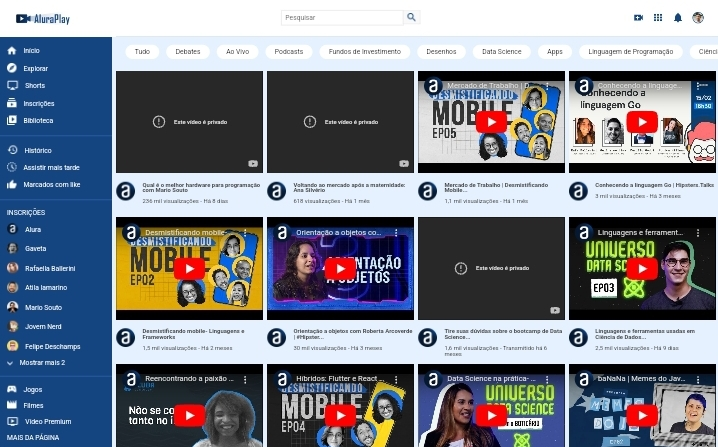

# 🚀 Alura Play
Projeto desenvolvido no curso de Flexbox da Alura.

## 🚀 Sobre o projeto
O projeto é uma página de vídeos da Alura. O aluno, junto ao professor, fica responsável por posicionar correatamente os elementos da página com as propriedades de Flexbox como ```display```, ```flex-direction```, ```justify-content```, entre outras.

## 🚀 Preview


## 🚀 Ferramentas Utilizadas
O projeto foi feito com as seguintes ferramentas:

- HTML e CSS